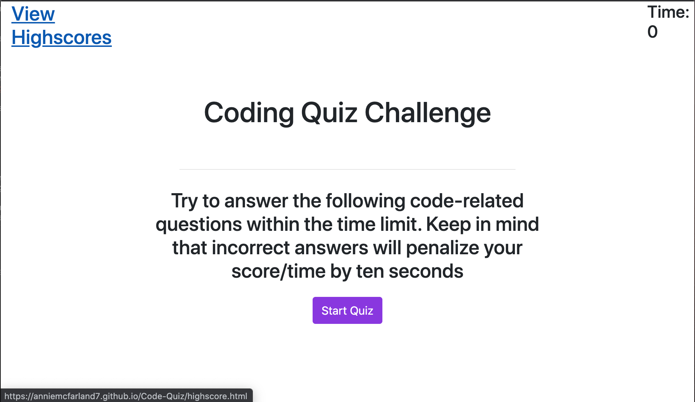

# Code Quiz

## Description 

If you are progressing in becoming a full-stack web developer, it’s likely that you’ll be asked to complete a coding assessment, perhaps as part of an interview process. A typical coding assessment is a combination of multiple-choice questions and interactive coding challenges. 

To help you become familiar with these tests and give you a chance to apply the skills from this module, this is a timed test similar to what you may come across.

The user will simply need to click the "Start Quiz" button, and a series of questions will begin. Once finished, you can save your score and initials.

Website URL: https://anniemcfarland7.github.io/Code-Quiz/

Repository URL: https://github.com/anniemcfarland7/Code-Quiz

## Screenshot 

The following image shows the web application's initial appearance:

